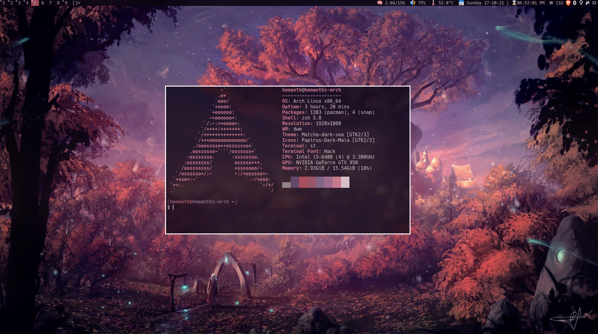

<b>My personal build of Suckless' Dynamic Window Manager</b>

### Why DWM?

Keeping things simple, minimal and usable.

**dwm** is customized through editing its source code, which makes it extremely
fast and secure - it does not process any input data which isn't known at
compile time. To customize it for your needs, you need to know C.

**Because dwm is customized through editing its source code, it's pointless to
make binary packages of it. This keeps its userbase small and elitist. No
novices asking stupid questions.**

To learn more about the Philosophy of Suckless Software, and their other tools,
head over to [suckless.org](https://suckless.org).

### Patches/Additional Features

- [x] [vanity-gaps](./patches/dwm-vanitygaps-6.2.diff)
- [x] [always-centered](./patches/dwm-alwayscenter-20200625-f04cac6.diff)
- [x] [systray](./patches/dwm-systray-20210418-67d76bd.diff)
- [x] [no-title](./patches/dwm-notitle-6.2.diff)
- [x] [rotate-stack](./patches/dwm-rotatestack-20161021-ab9571b.diff)
- [x] [layout-scroll](./patches/dwm-layoutscroll-6.2.diff)
- [x] [shift-view](./patches/shiftview.c)
- [x] [actual-fullscreen](./patches/dwm-actualfullscreen-20191112-cb3f58a.diff)
- [x] [focusonnetactive](./patches/dwm-focusonnetactive-6.2.diff)
- [x] [dwmblocks](https://github.com/hemanth-kotagiri/dwmblocks)
- [x] [swallow](./patches/dwm-swallow-20201211-61bb8b2.diff)
- [x] [pertag](./patches/dwm-pertag-20200914-61bb8b2.diff)
- [x] [no-border](./patches/dwm-noborder-6.2.diff)
- [x] [focusmaster](./patches/dwm-focusmaster-return-6.2.diff)

### Optional

- [ ] vacant-tags
- [x] scratchpad - This behaviour is attained by using [tdrop](https://github.com/noctuid/tdrop).

These patches are applied across different branches and are merged into the
master - Maintaing a simple error-free development workflow for the rice.

Colors for this build of DWM are defined by the headerfile generated by [pywal](https://github.com/dylanaraps/pywal).

### Dependencies

- libxft-bgra-git
- joypixels-font
